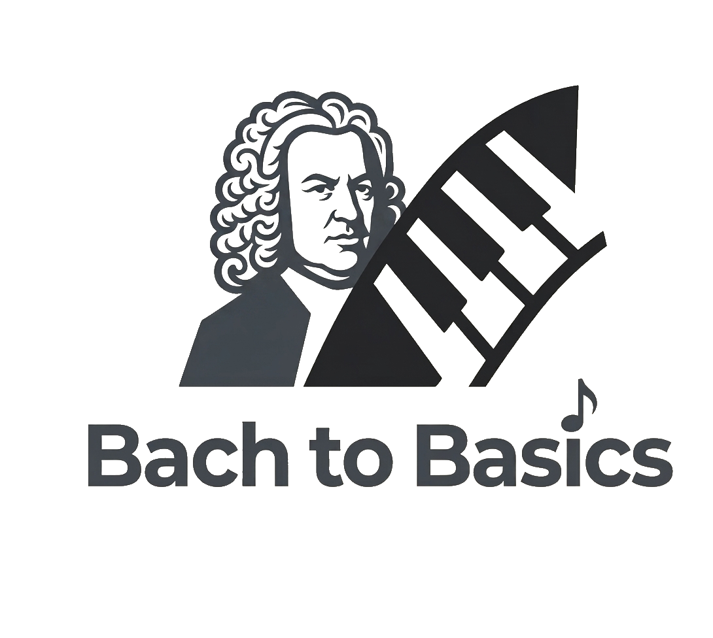
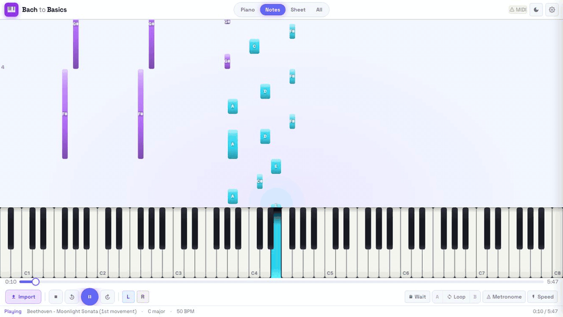
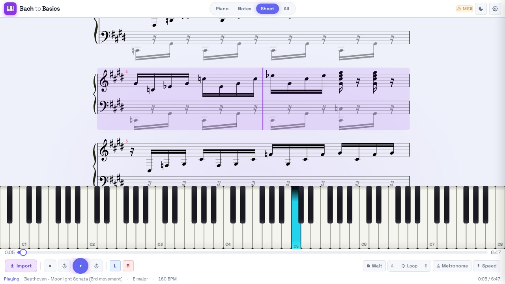
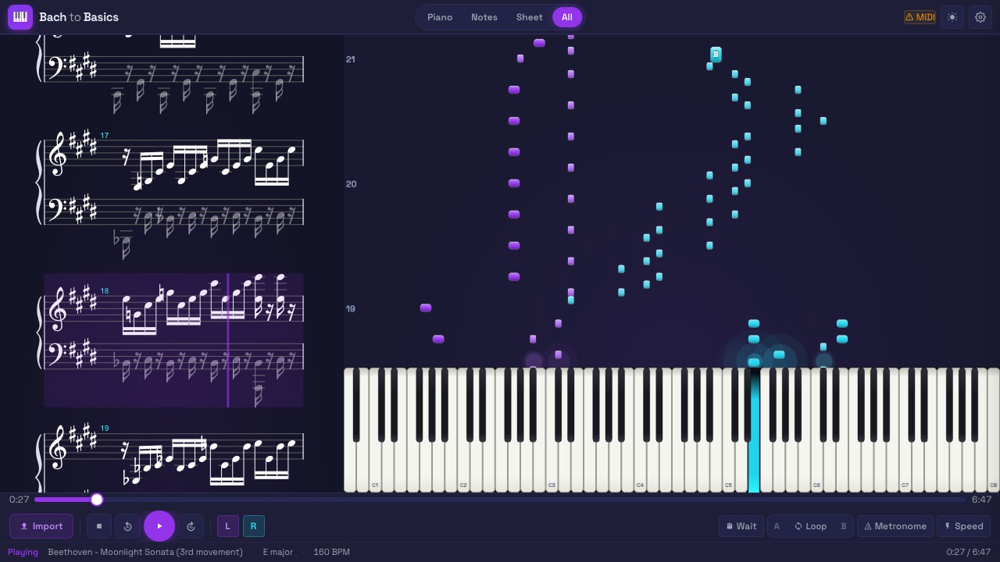
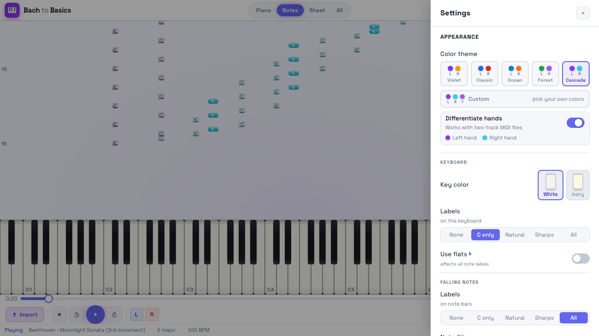

<p align="center">
  <a href="https://github.com/gigliof/bach-to-basics">
    
  </a>
</p>

<p align="center">
  <a href="https://github.com/gigliof/bach-to-basics/blob/main/LICENSE"></a>
  <a href="https://github.com/gigliof/bach-to-basics/issues"></a>
</p>

A browser-based piano practice tool. Drop in a **MIDI file**, a **MusicXML score**, or even a **PDF of sheet music**. Bach to Basics turns it into synced views of falling notes, an interactive 88-key piano, and rendered sheet music, then layers on practice tools (A/B loop, speed trainer, wait mode, metronome, transpose) to help you learn the piece.



| Sheet music | All views | Settings |
|---|---|---|
|  |  |  |

## Features

### Import

- **MIDI** (`.mid`, `.midi`): parsed in a Web Worker, converted to MusicXML on the backend for sheet rendering
- **MusicXML** (`.xml`, `.mxl`): both uncompressed and compressed (zip-style) variants
- **PDF sheet music** (`.pdf`): optical music recognition via [Audiveris](https://github.com/Audiveris/audiveris) to MusicXML, then to MIDI (optional setup, see below)

Drag-and-drop anywhere on the window, or use the import button.

> ⚠️ **A note on import accuracy.** Both PDF-to-MIDI (optical music recognition) and MIDI-to-sheet-music (notation reconstruction) are inherently lossy conversions. Expect some inconsistencies:
> - **PDF imports** can mis-read notes, dynamics, ornaments, articulation, and voicing, especially with low-resolution scans, handwritten scores, or complex layouts. Audiveris is the best open-source OMR engine available, but no engine matches a careful human transcription.
> - **MIDI imports** produce sheet music by re-deriving notation from raw note timings. MIDI doesn't encode key signatures, beaming, voicing, articulation, or enharmonic spelling, so the rendered sheet is an interpretation, not a faithful reproduction of the composer's original score.
>
> For the cleanest sheet-music experience, import a **MusicXML** file (or `.mxl`) when you have one, which preserves full notation semantics end-to-end.

### Visualization

- **Falling notes**: Synthesia-style, GPU-accelerated via PixiJS. Hand-color separation, octave grid, measure numbers, optional beat lines, sustain-pedal indicators, ghost-notes-while-pedal-held, configurable impact effects (bloom / side burst / particle trail / off), and a "note outline" mode for high-contrast viewing.
- **Sheet music**: full notation rendering via AlphaTab, with auto-scrolling cursor that tracks playback. White background toggle so notation stays readable in dark mode.
- **88-key piano**: interactive keyboard with hover, press depth, ivory or white key themes. Tap keys to play; drag across them to glissando.

### Practice tools

- **A/B loop** with click-to-set markers; the loop region highlights across all three views
- **Speed trainer**: auto-ramps tempo on each loop pass (configurable start %, end %, step %)
- **Wait mode**: playback pauses until you play the correct note. Per-hand: wait for left only, right only, or both.
- **Count-in**: 0, 1, or 2 bars of metronome before the music starts
- **Metronome**: accent on downbeat
- **Transposition**: shift the whole score ±12 semitones
- **Per-hand volume**: solo or mute either hand independently
- **Render-offset**: shift audio scheduling ±200 ms to compensate for audio interface latency

### Audio & MIDI

- **5 instrument options**: Splendid Grand Piano, Bright Acoustic, CP80 Electric, Harpsichord, Honky-Tonk (sampled, via [smplr](https://github.com/danigb/smplr))
- **MIDI input** via Web MIDI: connect a hardware keyboard (Roland, Yamaha, etc.); your input lights up the on-screen keys and drives wait mode
- **Tempo control**: 25%-200% with snap-back to 100%

### Look & feel

- **Color themes**: Cascade, Violet, Classic, Ocean, Forest, or fully custom (left/right/unknown hand colors)
- **Dark / light mode**: system-aware initial theme, manual override
- **Note labels**: none, C-only, white keys, black keys, or all

## Tech stack

| Layer | Technology |
|-------|-----------|
| Frontend | React 19, TypeScript, Vite, Tailwind CSS |
| Rendering | PixiJS 8 (falling notes + piano), AlphaTab (sheet music) |
| Audio | Tone.js (scheduling), smplr (sampled instruments), Web Audio API |
| MIDI input | WebMidi.js |
| State | Zustand |
| Backend | FastAPI (Python 3.11/3.12) |
| Music processing | music21, defusedxml |
| OMR (optional) | Audiveris (Java) |

## Running the app

### Option A: Docker (recommended for end users)

The simplest way. Requires only Docker Desktop (or Docker Engine + Compose).

```bash
docker compose up        # build the images on first run, then start
open http://localhost:5173
```

That's it. Stop with `Ctrl+C` (or `docker compose down`).

> Optional: copy `.env.example` to `.env` and set `BACKEND_API_KEY` if you want to require an API key on the backend.

### Option B: Native (recommended for development)

You'll need:

- **Node.js** 20+ and **pnpm** (`npm i -g pnpm`)
- **Python** 3.11 or 3.12
- **Java 17+**, only needed for PDF import via Audiveris

```bash
pnpm install
pnpm backend:setup      # creates backend/.venv with the core deps
pnpm dev                # frontend on :5173, backend on :8000, with hot reload
```

### Optional: PDF import via Audiveris

PDF to MusicXML uses [Audiveris](https://github.com/Audiveris/audiveris), an open-source OMR engine.

1. Download `audiveris.jar` from [Audiveris releases](https://github.com/Audiveris/audiveris/releases)
2. Place it at `backend/bin/audiveris.jar`
3. Make sure Java 17+ is on `PATH` (Docker users: already included in the image)

Without the JAR, MIDI / MusicXML import still works, only PDF import is unavailable.

## Using the app on iPad / iPhone (same network)

1. In `frontend/vite.config.ts`, add `host: true` to the `server` block (or run `pnpm --filter frontend dev --host`)
2. Find your computer's LAN IP (System Settings > Network on macOS)
3. On the iPad, open `http://<your-ip>:5173`

⚠️ **Web MIDI is not available on iOS**, the on-screen keyboard works, but you cannot connect a hardware piano via USB or Bluetooth from iOS Safari. This is a WebKit limitation Apple has not addressed.

## Configuration

All backend settings come from environment variables. Copy `.env.example` to `.env` and edit.

| Variable | Default | Description |
|----------|---------|-------------|
| `ALLOWED_ORIGINS` | `http://localhost:5173` | Comma-separated list of allowed CORS origins |
| `BACKEND_API_KEY` | *(unset = open)* | When set, all requests must include `X-API-Key: <value>` |
| `REQUIRE_AUTH` | *(unset)* | Set to `1` to make the server refuse to start if `BACKEND_API_KEY` is not configured — useful for preventing accidental open deployments |
| `RATE_LIMIT_PER_MIN` | `60` | Max requests per IP per minute. `0` disables it |
| `HEAVY_RATE_LIMIT_PER_MIN` | `10` | Stricter limit applied to expensive endpoints (`/omr/`, `/youtube/`) |
| `TRUSTED_PROXY_IPS` | *(unset)* | Comma-separated IPs of trusted reverse proxies. When set, the real client IP is read from `X-Forwarded-For` instead of the connection address |
| `MUSIC21_TIMEOUT_S` | `60` | Hard timeout (seconds) for music21 conversions (MIDI-to-MusicXML, MusicXML-to-MIDI). Raise for very dense scores |
| `AUDIVERIS_TIMEOUT_S` | `120` | Hard timeout (seconds) for Audiveris OMR. Raise for large or multi-page PDFs |

> **Web MIDI requires HTTPS** in production. Plain `http://` only works on `localhost`.

## Project layout

```
bach-to-basics/
├── frontend/                     # React app (Vite)
│   ├── src/
│   │   ├── components/
│   │   │   ├── FallingNotes/     # PixiJS falling-note renderer
│   │   │   ├── PianoKeyboard/    # PixiJS 88-key keyboard
│   │   │   ├── SheetMusic/       # AlphaTab sheet music view
│   │   │   └── Transport/        # Transport bar + settings panel
│   │   ├── engine/               # SyncEngine, AudioEngine, MidiClock
│   │   ├── store/                # Zustand app state
│   │   ├── utils/                # Shared utilities
│   │   ├── views/                # PracticeView (main layout)
│   │   └── workers/              # MIDI parsing in a Web Worker
│   └── public/                   # Static assets (soundfont)
├── backend/                      # FastAPI backend
│   ├── routers/                  # transcribe, omr, youtube, export, fingering
│   └── services/                 # blocking work (music21, Audiveris, etc.)
├── shared/                       # TypeScript types shared with the frontend
├── docker-compose.yml            # 1-command run for end users
└── package.json                  # pnpm workspace root
```

## Browser support

Requires a Chromium-based browser (Chrome, Edge, Brave, Arc) for **Web MIDI API** support. Firefox and Safari don't implement Web MIDI; on those, the on-screen keyboard still works but hardware MIDI input does not.

## Roadmap

The backend already exposes endpoints for several features that don't yet have UI hooks:

- **Audio-to-MIDI transcription** via [Basic Pitch](https://github.com/spotify/basic-pitch) (`/transcribe/mp3`)
- **YouTube-to-MIDI** via yt-dlp + Basic Pitch (`/youtube/extract`), sync data model already in place
- **Auto-fingering** via [pianoplayer](https://github.com/marcomusy/pianoplayer) (`/fingering/generate`)
- **Export** to PDF / MP3 / MIDI / MusicXML (`/export/pdf`, `/export/mp3`)

These will become user-facing in upcoming releases. PRs welcome.

## Troubleshooting

<details>
<summary><strong>Sheet music doesn't render after loading a MIDI file</strong></summary>

The MIDI-to-MusicXML conversion runs on the backend. Check that the backend is up (`curl http://localhost:8000/health` should return OK) and look at the backend terminal for `music21` errors. Very dense scores can hit the `MUSIC21_TIMEOUT_S` (default 60s); raise it if needed.
</details>

<details>
<summary><strong>No sound from the on-screen piano</strong></summary>

The first interaction (any click) wakes the audio context. If you still hear nothing, open DevTools > Console and look for errors related to `AudioContext` or sample fetches from `danigb.github.io` / `gleitz.github.io`. Some corporate networks block these CDNs.
</details>

<details>
<summary><strong>"WebMIDI not supported" on Firefox or Safari</strong></summary>

Use Chrome, Edge, Brave, or Arc. Firefox and Safari haven't implemented Web MIDI.
</details>

<details>
<summary><strong>PDF import says "OMR engine not available"</strong></summary>

Either Audiveris isn't installed, or `audiveris.jar` isn't at `backend/bin/audiveris.jar`, or Java 17+ isn't on the PATH. See the PDF import section above. MIDI and MusicXML import are unaffected.
</details>

<details>
<summary><strong>Docker build fails on the frontend</strong></summary>

The frontend Dockerfile uses the repo root as build context to read `pnpm-workspace.yaml` and `shared/`. If you've moved or renamed those, update `docker-compose.yml`'s `build.context` accordingly.
</details>

## Contributing

See [CONTRIBUTING.md](CONTRIBUTING.md). Bug reports and PRs welcome.

## License

[MIT](LICENSE) for this codebase.

Third-party components (AlphaTab, music21, etc.) keep their own licenses, see [NOTICE](NOTICE) for the rundown. Notably:

- **AlphaTab** is MPL-2.0 (per-file copyleft), fine for both open source and commercial use as long as you don't modify AlphaTab's own files.
- **Audiveris** is AGPL-3.0 and is *not* bundled, users download it separately, so this repo doesn't inherit AGPL obligations.
